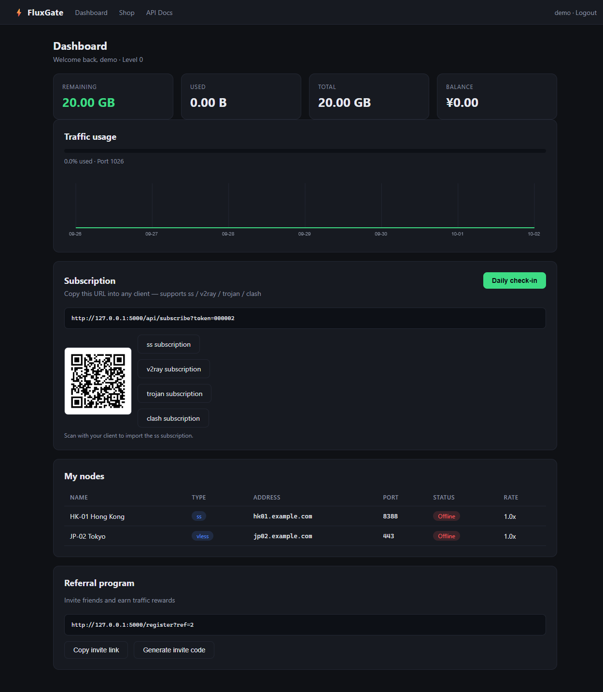
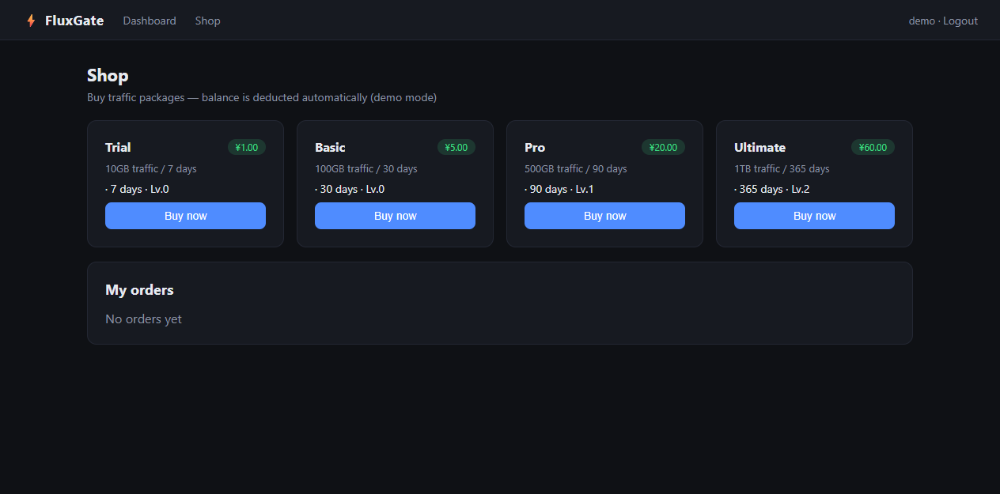
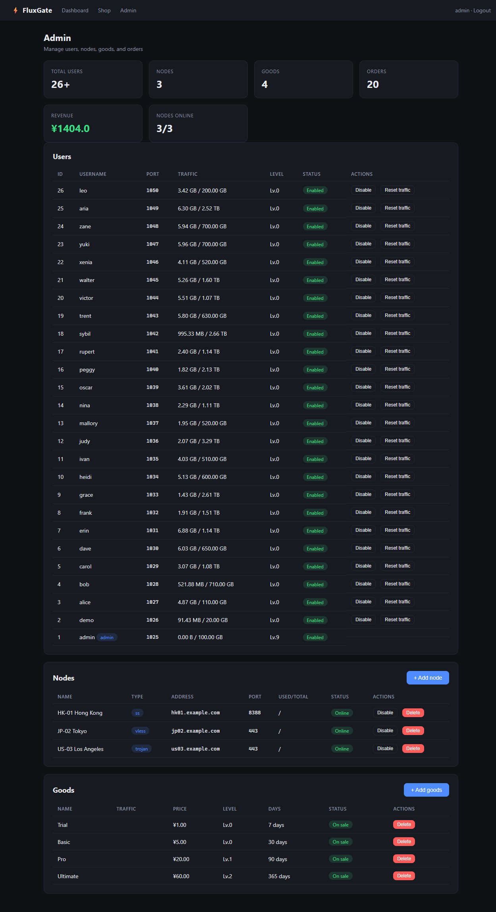

# FluxGate ⚡

> Self-hosted proxy management panel — users, nodes, subscriptions, and billing in one process.

      [](https://github.com/scar8969/fluxgate/actions/workflows/ci.yml) 

**FluxGate** is a self-hosted management panel for proxy services. Users register with invite codes, buy traffic packages, and get subscription links for any client. Admins manage nodes, goods, and orders from a built-in dashboard. Everything runs in a single Python process — no Redis, no Celery, no external services.

## Why FluxGate

Proxy panels are either abandoned, bloated, or locked behind paid SaaS. FluxGate is:

- **Single-process** — Flask + SQLAlchemy + SQLite, `python run.py` and you're live
- **Multi-protocol** — ss / v2ray / trojan / clash subscriptions out of the box
- **Self-contained** — web UI, admin, API, and billing all built in
- **Demo-ready** — seeded accounts + a data simulator that makes the panel look alive in 30 seconds

## Features

- 🔑 **Invite-code registration** — no spam users, referral rewards for inviters
- 📦 **Goods & billing** — traffic packages with level gating, order lifecycle, payment callback
- 🔗 **Subscription engine** — `ss://`, `vmess://`, `vless://`, `trojan://`, and full Clash YAML with proxy-groups
- 📱 **QR codes** — scan-to-import subscription links
- 📊 **Traffic accounting** — per-user per-node logs, auto-disable on quota overflow
- 📈 **Live charts** — 7-day upload/download traffic curves on the dashboard
- 🟢 **Node health** — backend heartbeat → online/offline status
- 🤖 **Sample backend agent** — `backend.py` polls config, simulates traffic, reports back (closes the loop)
- 📈 **Admin analytics** — revenue + signup trends chart, CSV exports
- 🎁 **Daily check-in** — random traffic reward, once per day
- 🛡️ **Backend API** — token-authenticated node config + traffic reporting
- 🚦 **Login rate limiting** — brute-force protection
- 📡 **Prometheus metrics** — `/api/metrics` for monitoring
- 🔔 **Webhooks** — `order.paid` events on completed payments
- 📚 **API docs** — built-in `/api/docs` page
- 👑 **Admin dashboard** — CRUD for users/nodes/goods, revenue stats

## Architecture

```
fluxgate/
├── __init__.py      # app factory, config, db init
├── models.py        # User, Goods, UserOrder, InviteCode, UserCheckInLog, UserRefLog
├── proxy.py         # ProxyNode (ss/vless/trojan), UserTrafficLog, heartbeat
├── sub.py           # subscription engine: ss:// vmess:// vless:// trojan:// clash YAML
├── api.py           # JSON API blueprint
├── web.py           # web UI blueprint (dashboard/shop/admin)
├── seed.py          # demo data (admin/demo users, 3 nodes, 4 goods)
└── templates/       # dark dashboard UI
```

```
                    ┌──────────────┐
                    │   Web UI     │  register/login · dashboard · shop · admin
                    └──────┬───────┘
                           │
                    ┌──────▼───────┐
                    │  Flask API   │  /api/subscribe · /api/proxy_configs · /api/orders
                    └──────┬───────┘
                           │
              ┌────────────┼────────────┐
              ▼            ▼            ▼
        ┌──────────┐ ┌──────────┐ ┌──────────┐
        │  Users   │ │  Nodes   │ │  Orders  │
        │ goods    │ │ ss/vless │ │ payment  │
        │ invite   │ │ trojan   │ │ callback │
        │ traffic  │ │ heartbeat│ │          │
        └──────────┘ └──────────┘ └──────────┘
              │            │
              ▼            ▼
        ┌────────────────────────┐
        │  Subscription engine   │  ss:// · vmess:// · vless:// · trojan:// · clash
        └────────────────────────┘
```

## Quick start

```bash
python -m venv .venv
.venv/Scripts/python -m pip install -r requirements.txt   # Windows
# .venv/bin/python -m pip install -r requirements.txt     # Linux/macOS
.venv/Scripts/python run.py
```

Open http://127.0.0.1:5000

| Account | Password | Role |
|---|---|---|
| `admin` | `admin123` | admin (manage users/nodes/goods) |
| `demo` | `demo123` | regular user |

### Make it look alive

```bash
.venv/Scripts/python simulate.py 24 30   # 24 users, 30 days of traffic
```

Generates realistic usage: staggered signups, purchase history, diurnal traffic curves, node heartbeats. The panel instantly looks like a real service.

### Run a backend node agent

```bash
.venv/Scripts/python backend.py --node 1 --users 5
```

The sample agent polls the panel for its config, simulates user traffic with a diurnal pattern, and reports usage back (which doubles as a heartbeat). Run one per node to see the full loop: panel ↔ backend ↔ traffic.

### Docker

```bash
docker compose up -d
```

### Deploy

One-click deploys: [Render](render.yaml) or [Railway](railway.json). Both use gunicorn + the app factory.

## API surface

| Method | Path | Description |
|---|---|---|
| GET | `/api/subscribe?token=<id>&sub_type=ss` | subscription links (ss/v2ray/trojan/clash) |
| GET | `/api/subscribe/qr?token=<id>&sub_type=ss` | QR code PNG of subscription URL |
| GET | `/api/metrics` | Prometheus metrics |
| GET | `/api/docs` | API documentation page |
| GET | `/api/proxy_configs/<node_id>` | node config for backends (X-API-Token auth) |
| POST | `/api/proxy_configs/<node_id>` | traffic report + heartbeat from backends |
| POST | `/api/user/settings` | change ss password |
| GET | `/api/user/stats/traffic_chart` | per-node traffic chart |
| GET | `/api/user/stats/ref_chart` | referral chart |
| POST | `/api/checkin` | daily check-in traffic reward |
| POST | `/api/orders` | create order |
| POST | `/api/callback/alipay` | payment callback (demo) |
| GET | `/api/system_status` | admin stats (users/orders/revenue/online nodes) |
| POST | `/api/admin/nodes` | add node (admin) |
| DELETE | `/api/admin/nodes/<id>` | delete node (admin) |
| POST | `/api/admin/nodes/<id>/toggle` | enable/disable node (admin) |
| POST | `/api/admin/goods` | add goods (admin) |
| DELETE | `/api/admin/goods/<id>` | delete goods (admin) |
| POST | `/api/admin/users/<id>/toggle` | enable/disable user (admin) |
| POST | `/api/admin/users/<id>/reset_traffic` | reset user traffic (admin) |
| GET | `/api/admin/analytics?days=14` | revenue + signup trends (admin) |
| GET | `/api/admin/export/users` | CSV export of users (admin) |
| GET | `/api/admin/export/orders` | CSV export of orders (admin) |

## Screenshots





## Roadmap

- [x] Multi-protocol subscription engine
- [x] Invite codes + referral rewards
- [x] Goods/billing + payment callback
- [x] Traffic accounting + auto-disable
- [x] Live traffic charts
- [x] Node heartbeat / online status
- [x] Admin CRUD + revenue stats
- [x] Demo data simulator
- [x] Sample backend agent (panel ↔ backend loop)
- [x] Admin analytics + CSV exports
- [x] Login rate limiting
- [x] QR code subscriptions
- [x] Prometheus metrics
- [x] Webhooks (order.paid)
- [x] API docs page
- [x] Docker + CI
- [ ] Real Alipay/Stripe integration
- [ ] Multi-language i18n
- [ ] Telegram bot for notifications
- [ ] Prometheus metrics export

## Tests

```bash
.venv/Scripts/python -m pytest tests/ -v
```

38 tests covering: seed data, invite-code registration, login/logout, daily check-in, traffic overflow auto-disable, subscription generation (ss/v2ray/clash), level gating, order lifecycle, payment callback, API auth, admin-only routes, admin CRUD, node heartbeat, admin analytics, CSV exports, login rate limiting, QR codes, Prometheus metrics, webhooks, API docs, page rendering.

## License

GPL-3.0
